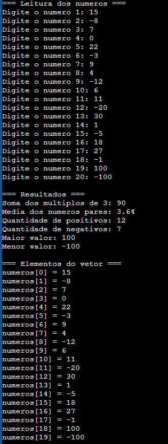

# 📊 Array / Vetor em C


---

## 🇧🇷 Português

### Identificação do estudante
- **Nome:** Piêtro Bitencourt Nunes
- **Disciplina:** Algoritmos e Pensamento Computacional

### Objetivo
Desenvolver um programa em linguagem C que aplique os conceitos de arrays (vetores), estruturas de repetição, estruturas condicionais, entrada de dados e operações matemáticas.

O programa lê 20 números inteiros digitados pelo usuário, armazena-os em um vetor e calcula:
- a soma dos elementos múltiplos de 3;
- a média dos elementos pares;
- a quantidade de números positivos e negativos;
- o maior e o menor valor do vetor;
- exibe, ao final, todos os elementos armazenados.

### Lógica utilizada
- Um vetor de 20 posições (`int numeros[20]`) armazena os números lidos.
- A leitura é feita com um laço `for`, validando cada entrada com o retorno do `scanf`: se o usuário digitar algo que não seja um número inteiro, o programa exibe um aviso e pede a entrada novamente, limpando o buffer com `getchar()` para evitar loops de erro.
- Um segundo laço `for` percorre o vetor uma única vez, aplicando quatro verificações independentes (múltiplo de 3, par, positivo/negativo, maior/menor) a cada elemento.
- O valor `0` é tratado como um caso especial: não é contabilizado nem como positivo nem como negativo, conforme exigido pelo enunciado.
- A média dos pares só é calculada se existir pelo menos um número par no vetor, evitando divisão por zero.

### Como compilar e executar
```bash
gcc array_vetor.c -o array_vetor
./array_vetor        # Linux/macOS
array_vetor.exe      # Windows
```

### Exemplo de entrada e saída
**Entrada:**
```
15 -8 7 0 22 -3 9 4 -12 6 11 -20 30 1 -5 18 27 -1 100 -100
```

**Saída (resumo):**
```
Soma dos multiplos de 3: 90
Media dos numeros pares: 3.64
Quantidade de positivos: 12
Quantidade de negativos: 7
Maior valor: 100
Menor valor: -100
```

### Capturas de tela


### Estrutura do repositório
```
array-vetor/
├── array_vetor.c
├── README.md
└── evidencias/
    └── 01-execucao-programa.png
```

---

## 🇬🇧 English

### Student identification
- **Name:** Piêtro Bitencourt Nunes
- **Course:** Algorithms and Computational Thinking

### Objective
Develop a C program that applies the concepts of arrays, loops, conditional structures, data input, and mathematical operations.

The program reads 20 integers entered by the user, stores them in an array, and calculates:
- the sum of the elements that are multiples of 3;
- the average of the even elements;
- the count of positive and negative numbers;
- the highest and lowest values in the array;
- finally, it displays every element stored in the array.

### Logic used
- A 20-position array (`int numeros[20]`) stores the numbers entered by the user.
- Input is read with a `for` loop, validating each entry through `scanf`'s return value: if the user enters something other than an integer, the program shows a warning and asks again, clearing the input buffer with `getchar()` to avoid error loops.
- A second `for` loop goes through the array once, applying four independent checks (multiple of 3, even, positive/negative, max/min) to each element.
- The value `0` is treated as a special case: it is not counted as either positive or negative, as required by the assignment.
- The average of the even numbers is only calculated if at least one even number exists, avoiding division by zero.

### How to compile and run
```bash
gcc array_vetor.c -o array_vetor
./array_vetor        # Linux/macOS
array_vetor.exe      # Windows
```

### Example input and output
**Input:**
```
15 -8 7 0 22 -3 9 4 -12 6 11 -20 30 1 -5 18 27 -1 100 -100
```

**Output (summary):**
```
Soma dos multiplos de 3: 90
Media dos numeros pares: 3.64
Quantidade de positivos: 12
Quantidade de negativos: 7
Maior valor: 100
Menor valor: -100
```

### Screenshots


### Repository structure
```
array-vetor/
├── array_vetor.c
├── README.md
└── evidencias/
    └── 01-execucao-programa.png
```
